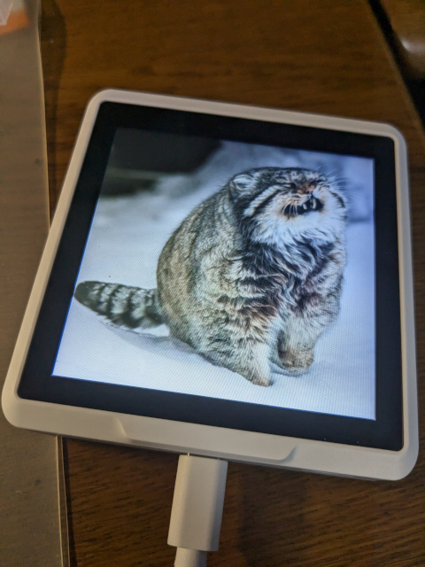
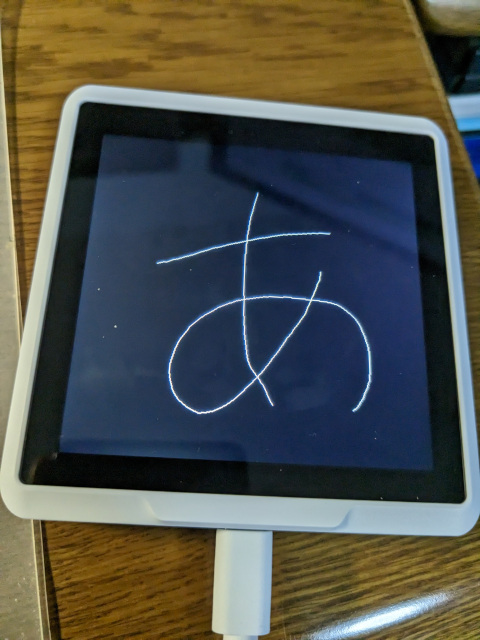

# SenseCAP Indicatorテスト用リポジトリ
## 動作環境
|||
|---|---|
| 使用モデル | SenseCAP indicator D1 |
| OS | Windows11 22H2 |
| 開発環境 | Arduino IDE 2.2.1   PlatformIO(サンプル未作成)|

## ver.Arduino IDE
### 環境構築について
** TODO:ここに環境構築MDのリンク挿入 **

### 画像表示
起動時に画像を表示するサンプル  
** TODO:ここにサンプルリンク挿入 **  

### タッチパネル
タッチパネルでLCD上にペイントするサンプル  
左上部にあるボタンで全消し  
** TODO:ここにサンプルリンク挿入 **  

## 参考サイト
- 公式Wiki  
https://wiki.seeedstudio.com/Sensor/SenseCAP/SenseCAP_Indicator/Get_started_with_SenseCAP_Indicator/
- SenseCAP IndicatorでLovyanGFXを動かす  
https://qiita.com/fukuebiz/items/de6007c651255dd2458b
- LovyanGFXの描画系まとめ  
https://lang-ship.com/blog/work/lovyangfx-1/
- MicroSDの画像ファイルをLCDに表示させる  
https://qiita.com/rnatori/items/66dee472ff7132b6e7c3